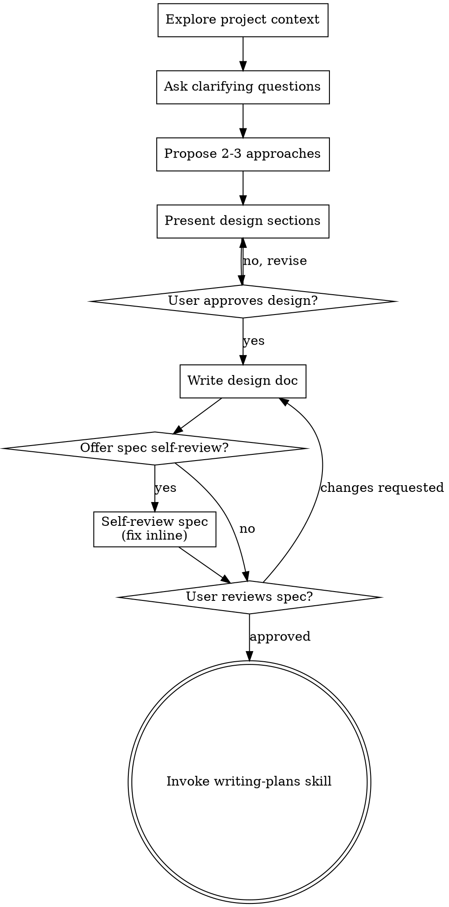

# Brainstorming Ideas Into Designs

Help turn ideas into fully formed designs and specs through natural collaborative dialogue.

Start by understanding the current project context, then ask questions one at a time to refine the idea. Once you understand what you're building, present the design and get user approval.

<HARD-GATE>
Do NOT invoke any implementation skill, write any code, scaffold any project, or take any implementation action until you have presented a design and the user has approved it. This applies to EVERY feature regardless of perceived simplicity.
</HARD-GATE>

## Anti-Pattern: "This Is Too Simple To Need A Design"

Every feature goes through this process. A new ROS2 topic, a single algorithm function, a config change — all of them. "Simple" things are where unexamined assumptions cause the most wasted work. The design can be short (a few sentences for truly simple features), but you MUST present it and get approval.

## Checklist

You MUST create a task for each of these items and complete them in order:

1. **Explore project context** — check existing modules, headers, CMakeLists, recent commits
2. **Ask clarifying questions** — one at a time, understand purpose/constraints/success criteria
3. **Propose 2-3 approaches** — with trade-offs and your recommendation
4. **Present design** — in sections scaled to their complexity, get user approval after each section
5. **Write design doc** — save to `YYYY-MM-DD-<topic>-design.md` in the repo root — DO NOT git commit
6. **Spec review (optional)** — offer to self-review the spec; if accepted, check for TBDs, contradictions, ambiguity, and scope issues
7. **User reviews written spec** — ask user to review the spec file before proceeding
8. **Transition to implementation** — invoke writing-plans skill to create implementation plan

## Process Flow

**The terminal state is invoking writing-plans.** Do NOT invoke any other implementation skill. The ONLY skill you invoke after brainstorming is writing-plans.

## The Process

**Understanding the idea:**

- Explore existing module structure first: headers in `include/`, sources in `src/`, CMakeLists, recent git log
- Before asking detailed questions, assess scope: if the request spans multiple independent subsystems (e.g., a new sensor integration + a new pipeline stage + a new ROS2 node), flag it immediately and help decompose into sub-projects. Each sub-project gets its own spec → plan → implementation cycle.
- For appropriately-scoped work, ask questions one at a time to refine the idea
- Prefer multiple choice questions when possible, but open-ended is fine too
- Only one question per message — if a topic needs more exploration, break it into multiple questions
- Focus on understanding: purpose, constraints, success criteria, performance requirements

**Exploring approaches:**

- Propose 2-3 different approaches with trade-offs
- Present options conversationally with your recommendation and reasoning
- Lead with your recommended option and explain why
- Ground trade-offs in concrete concerns: latency, allocation on the per-frame path, interface coupling, testability, fit with existing patterns

**Presenting the design:**

Once you believe you understand what you're building, present the design. Cover these aspects (scale each to its complexity):

- **Module placement** — which package, which directory, new file(s) vs. extending existing ones; build system changes needed
- **Interface** — class/function names, public API (method signatures, return types), key data members
- **Integration** — how it connects to the rest of the system (topics, services, callbacks, etc.) if applicable
- **Data flow** — how data enters, transforms, and exits the component; where it sits in the pipeline
- **Performance constraints** — what runs on the hot path (no heap allocation, no blocking), what is startup-only
- **Error handling** — which failure paths use optional/expected/result types, which trigger contract violations
- **Testing** — test structure, what inputs to exercise, what to mock (if anything)
- **Build integration** — new source files, any new dependencies

Ask after each section whether it looks right so far. Be ready to go back and clarify.

**Design for isolation and clarity:**

- Break the system into smaller units that each have one clear purpose, communicate through well-defined interfaces, and can be understood and tested independently
- For each unit: what does it do, how do you use it, what does it depend on?
- Can someone understand what a unit does without reading its internals? Can you change the internals without breaking consumers? If not, the boundaries need work.
- Smaller, well-bounded units are easier to work with — you reason better about code you can hold in context at once, and your edits are more reliable when files are focused. A file growing large is a signal it's doing too much.

**Working in existing codebases:**

- Follow existing patterns: sensor abstractions, operation lifecycle, frame transforms, error enum conventions
- Where existing code has problems that affect the work (e.g., a file grown too large, unclear boundaries), include targeted improvements as part of the design — the way a good developer improves code they're working in
- Don't propose unrelated refactoring. Stay focused on what serves the current goal.

## After the Design

**Documentation:**

- Write the validated design (spec) to `YYYY-MM-DD-<topic>-spec.md` in the relevant repo root
  - (User preferences for spec location override this default)
- DO NOT commit the design document to git

**Spec Self-Review (optional):**
After writing the spec, offer a self-review before handing it to the user:

> "Spec written to `<path>`. Would you like me to do a self-review first (check for TBDs, contradictions, ambiguity, and scope issues), or would you prefer to review it directly yourself?"

If the user accepts, review inline and fix any issues found, then proceed to the User Review Gate. If the user declines, skip straight to it.

**User Review Gate:**
Ask the user to review the spec before proceeding:

> "Spec written to `<path>`. Please review it and let me know if you want to make any changes before we start writing out the implementation plan."

Wait for the user's response. If they request changes, update the spec. Only proceed once the user approves.

**Implementation:**

- Invoke the writing-plans skill to create a detailed implementation plan
- Do NOT invoke any other skill. writing-plans is the next step.

## Key Principles

- **One question at a time** — Don't overwhelm with multiple questions
- **Multiple choice preferred** — Easier to answer than open-ended when possible
- **YAGNI ruthlessly** — Remove unnecessary features from all designs
- **Explore alternatives** — Always propose 2-3 approaches before settling
- **Incremental validation** — Present design, get approval before moving on
- **Be flexible** — Go back and clarify when something doesn't make sense
- **Respect the rules** — Every design must be consistent with the coding rules in CLAUDE.md; flag any tension early rather than leaving it for implementation
